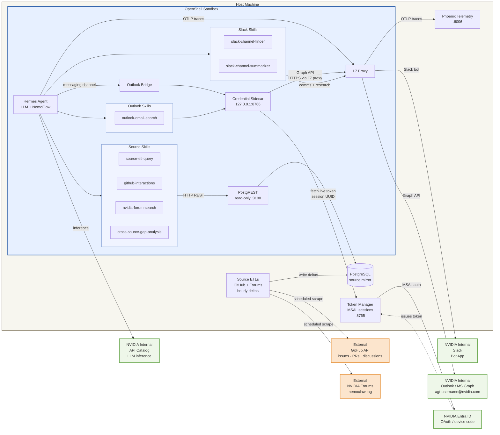

# NemoClaw Hermes Setup Guide (NVIDIA Internal)

This guide walks through standing up a NemoClaw Hermes sandbox from source with the
policy set and credentials needed for Slack, Outlook, and host-side Postgres
research access. GitHub and NVIDIA forum ingestion happen outside OpenShell through
the `source-etls/` stack, not through live sandbox egress. It covers building from
source, creating the Slack app, configuring credentials, and running the first onboard.

> **Important**
>
> Run `git submodule update --init --recursive` immediately after cloning and before
> any build or onboard step. The NeMo-Flow Hermes telemetry path is gated on the
> `third_party/nemo-flow` submodule contents, not just on the parent repo commit.
> If the submodule is not initialized, onboard falls back to the standard Hermes
> base image and skips the patched NeMo-Flow image path.

---

## Architecture

The Hermes sandbox operates with a deliberately narrow egress policy. It connects
live to Slack and Outlook for interactions and research. GitHub and NVIDIA forum
data are never fetched live from inside the sandbox — instead, host-side ETL
containers scrape those sources on a schedule and write results into Postgres.
The sandbox queries that mirror through a read-only PostgREST HTTP bridge.



**Key points:**

- The agent never has direct network access to GitHub or the NVIDIA forums. All
  GitHub and forum data the agent sees comes from the Postgres mirror.
- Slack and Outlook are live connections from the sandbox; the agent can read and
  write both in real time.
- NVIDIA API Catalog egress is required for compatible-endpoint model inference.
  It is not a research/data-ingestion path.
- The ETL containers are non-agentic — they run fixed scraper logic on an interval
  and have no LLM involvement.
- The PostgREST bridge exposes a read-only HTTP API on host port 3100 and on
  internal port 3000 in the `openshell-cluster-nemoclaw` gateway Docker network,
  so the sandbox can reach it without live GitHub or NVIDIA forum egress.

---

## Prerequisites

- Linux host (Ubuntu 22.04+ recommended) with Docker installed and running
- Access to [NVIDIA API Catalog](https://build.nvidia.com) for a compatible-endpoint inference API key
- A Slack workspace where you have permission to create apps
- Node.js 22.16+ and npm
- Python 3.11+ and `uv`
- `git`

Verify the host actually meets those tool prerequisites before starting:

```bash
node --version
command -v uv
```

If your host `node` is older than 22.x, or `uv` is missing from `PATH`, fix that
first. The source build and onboard flow assume both are available.

---

## 1. Clone and Build from Source

```bash
git clone https://github.com/mpenn/NemoClaw.git
cd NemoClaw
git checkout community-sentiment-issue-tracker-demo
git submodule update --init --recursive
```

If `third_party/nemo-flow/patches/hermes-agent/0001-add-nemo-flow-integration.patch`
is missing after clone, the submodule is not initialized correctly and the telemetry
build path will be skipped.

Verify you are actually running Node 22 for the CLI. If your host `node` is older,
use the `npx`-resolved binary for all npm-backed repo steps and NemoClaw commands:

```bash
node --version
NODE22=$(npx -y node@22 -p 'process.execPath')
"$NODE22" ./bin/nemoclaw.js --version
```

Install all dependencies and build from source:

```bash
"$NODE22" "$(command -v npm)" install
cd nemoclaw && "$NODE22" "$(command -v npm)" install && "$NODE22" "$(command -v npm)" run build && cd ..
cd nemoclaw-blueprint && uv sync && cd ..
```

Register the `nemoclaw` command on your PATH:

```bash
"$NODE22" "$(command -v npm)" link
```

After this, `nemoclaw` is available as a command in your shell. The rest of this
guide uses `nemoclaw` directly. If `npm link` fails with a permissions error, run
it with `sudo`.

---

## 2. Create the Slack App

NemoClaw communicates with Slack using a bot that you register through the Slack API
dashboard. The repo includes a pre-configured app manifest that sets the correct scopes
and event subscriptions.

### 2a. Create the app from the manifest

1. Copy `slack_app_manifest.json` to a local file and open it in a text editor.
2. Replace the three placeholder values with your own identifier:

   | Field | Placeholder | Example replacement |
   |-------|-------------|---------------------|
   | `display_information.name` | `MyUser NemoClaw` | `Alice NemoClaw` |
   | `features.bot_user.display_name` | `MyUser NemoClaw` | `Alice NemoClaw` |
   | `features.slash_commands[].command` | `/myuser-nemoclaw` | `/alice-nemoclaw` |

   The slash command must be lowercase and hyphen-separated. Note it down because
   you will see this name appear in Slack when users type `/`.

3. Go to [api.slack.com/apps](https://api.slack.com/apps) and click **Create New App**.
4. Choose **From an app manifest**, select your workspace, then click **Next**.
5. Paste your edited manifest JSON and click **Next**, review the permissions, then click **Create**.

The manifest configures:

- Socket Mode (no public URL required)
- Bot events: `message.im`, `message.channels`, `message.mpim`, `app_mention`
- OAuth scopes: `im:history`, `im:read`, `channels:history`, `chat:write`,
  `reactions:write`, `users:read`, and related DM/channel permissions
- Your custom slash command (for example `/alice-nemoclaw`)

### 2b. Enable Socket Mode

1. In your new app's settings, go to **Socket Mode** in the left sidebar.
2. Toggle **Enable Socket Mode** on.
3. When prompted, name the app-level token (for example `nemoclaw-socket`) and click
   **Generate**. Copy the token. It starts with `xapp-`.

   Note: if Slack behaves oddly here, toggle Socket Mode off and back on once.

### 2c. Install the app to your workspace

1. Go to **OAuth & Permissions** in the left sidebar.
2. Click **Install to Workspace** and authorize it.
3. Copy the **Bot User OAuth Token**. It starts with `xoxb-`.

### 2d. Find your Slack user ID

The sandbox only responds to users on the allowlist.

1. Open Slack and click your name or avatar.
2. Click **Profile**, then the **⋮** menu, then **Copy member ID**.
3. Save this. It looks like `U0887Q5UVV4`.

---

## 3. Get Your NVIDIA API Key

NemoClaw uses a compatible OpenAI-style endpoint for the agent's LLM. The default
template is wired to the NVIDIA integrate endpoint.

1. Go to [build.nvidia.com](https://build.nvidia.com) and sign in with your NVIDIA
   account.
2. Navigate to any model page and click **Get API Key**.
3. Copy the key. It starts with `nvapi-`.

---

## 4. Configure `.env`

Copy the template and fill in your values:

```bash
cp env.template .env
```

Open `.env` and fill in the following. The sandbox queries a host-side
Postgres database that is populated by `source-etls/`, so GitHub and forum data
live in that mirror rather than being fetched live from the sandbox.

```ini
NEMOCLAW_AGENT=hermes
NEMOCLAW_PROVIDER=compatible-endpoint
NEMOCLAW_ENDPOINT_URL=https://integrate.api.nvidia.com/v1
COMPATIBLE_API_KEY=nvapi-<your key from build.nvidia.com>
NEMOCLAW_PROVIDER_KEY=nvapi-<same key as above>
# NVIDIA_API_KEY=nvapi-<optional legacy variable; not used by this guide's compatible-endpoint flow>
NEMOCLAW_MODEL=qwen/qwen3-next-80b-a3b-instruct
NEMOCLAW_POLICY_MODE=custom

SLACK_BOT_TOKEN=xoxb-<your bot token from OAuth & Permissions>
SLACK_APP_TOKEN=xapp-<your app-level token from Socket Mode>
SLACK_ALLOWED_IDS=<your Slack user ID, e.g. U0887Q5UVV4>

GITHUB_TOKEN=<optional GitHub PAT; leave blank for public repos>
SOURCE_ETL_GITHUB_REPO=NVIDIA/NemoClaw
SOURCE_ETL_FORUM_TAG=nemoclaw
SOURCE_ETL_POSTGRES_HOST=host.openshell.internal
SOURCE_ETL_POSTGRES_PORT=5432
SOURCE_ETL_POSTGRES_DB=source_etls
SOURCE_ETL_POSTGRES_SUPERUSER=postgres
SOURCE_ETL_POSTGRES_SUPERUSER_PASSWORD=<set for the host-side Postgres container>
SOURCE_ETL_POSTGRES_APP_USER=source_etl_writer
SOURCE_ETL_POSTGRES_APP_PASSWORD=<set for the ETL writer user>
SOURCE_ETL_POSTGRES_READER_USER=source_etl_reader
SOURCE_ETL_POSTGRES_READER_PASSWORD=<set for the PostgREST read-only user>
SOURCE_ETL_API_PORT=3100
SOURCE_ETL_OPENSHELL_NETWORK=openshell-cluster-nemoclaw

OUTLOOK_TENANT_ID=<Microsoft tenant id>
OUTLOOK_CLIENT_ID=<Microsoft app client id>
OUTLOOK_TARGET_MAILBOX=<mailbox the bridge monitors, e.g. hermes@yourorg.com>
OUTLOOK_REPLY_TO=<reply-to address for outbound emails>
OUTLOOK_SESSION_UUID=<populated automatically by nemoclaw onboard; set manually for CI>

NEMOCLAW_SANDBOX_NAME=nemoclaw-hermes
NEMOCLAW_POLICY_PRESETS=slack,outlook,postgres

PHOENIX_COLLECTOR_ENDPOINT=http://172.17.0.1:6006/v1/traces
```

> **Note on `SLACK_ALLOWED_IDS`:** Only the user IDs listed here can message the bot.
> Add multiple IDs as a comma-separated list. This is the primary access control.
>
> **Note on `GITHUB_TOKEN`:** Optional. In this setup it is only used by the
> host-side GitHub ETL, not for live sandbox GitHub access. Leave it blank for
> public repos. Create a classic PAT at
> [github.com/settings/tokens](https://github.com/settings/tokens) with `repo`
> scope only if you need private repo support later.
>
> **Note on `SOURCE_ETL_OPENSHELL_NETWORK`:** This is the Docker network created
> by the OpenShell gateway, not the sandbox name. With the default gateway name
> used by this guide, the network is `openshell-cluster-nemoclaw`.
>
> **Note on `SOURCE_ETL_POSTGRES_HOST`:** Keep the default
> `host.openshell.internal` value in `.env`; the final policy applied after
> onboard is generated from the live Docker network IPs by `scripts/update-policy.sh`.
>
> **Note on ETL Postgres users:** The host-side ETLs write with
> `SOURCE_ETL_POSTGRES_APP_USER`. PostgREST connects with
> `SOURCE_ETL_POSTGRES_READER_USER`. Hermes only reaches the read-only REST
> bridge and does not need raw database credentials.
>
> **Note on `SOURCE_ETL_FORUM_TAG`:** The default forum source is the Discourse
> `nemoclaw` tag, not a single category page. The ETL ingests tagged topic
> JSON from the NVIDIA forums and writes it into Postgres.
>
> **Note on `NVIDIA_API_KEY`:** Some local `.env` files still carry `NVIDIA_API_KEY`
> from older or different inference flows. For this Hermes guide, the active path is
> `compatible-endpoint`, so `COMPATIBLE_API_KEY` and `NEMOCLAW_PROVIDER_KEY` are the
> variables that matter.

Smoke-test the compatible endpoint before building the sandbox:

```bash
bash scripts/test-compatible-endpoint.sh
```

This checks `GET /models` and a minimal `POST /chat/completions` using the model
and endpoint in `.env`.

---

## 5. Host-Side Source ETLs

This NVIDIA path assumes GitHub and NVIDIA forum data are scraped outside the
sandbox and written into Postgres for Hermes to query via PostgREST.

Target ETL defaults:

- GitHub repo: `NVIDIA/NemoClaw`
- NVIDIA forums tag: `nemoclaw`
- refresh interval: hourly
- initial backfill window: last 72 hours

The ETL implementation lives under `source-etls/` and runs on the host, outside
OpenShell. Start it after the first onboard step creates the OpenShell gateway
network; the exact commands are in [7b. Start the host-side source ETLs](#7b-start-the-host-side-source-etls).

This brings up four containers:

| Container | Role |
|-----------|------|
| `postgres` | Shared data store and ETL metadata |
| `github-etl` | Scrapes GitHub issues, PRs, and discussions on an hourly interval |
| `forums-etl` | Scrapes NVIDIA Developer Forum topics on an hourly interval |
| `postgrest` | Read-only HTTP API bridge on `:3100` exposing the `api` schema |

### Docker network requirement

The `postgrest` container must be reachable from the OpenShell L7 proxy on the
gateway cluster network. The `docker-compose.yml` declares an external network
named by `SOURCE_ETL_OPENSHELL_NETWORK`, defaulting to
`openshell-cluster-nemoclaw`, and attaches `postgrest` to it automatically.

This network is created by the OpenShell gateway when the sandbox is first started.
**Run onboard before `docker compose up`**, or the external network will not exist
yet and compose will fail.

The Hermes sandbox policy set for this path is intentionally narrow:

- `slack`
- `outlook`
- `postgres`

Do not add `github` or `nvidia-forum` presets for this path. The ETL mirror is
the intended source for that data. Adding those presets would give the sandbox
live egress to external hosts that it does not need and should not have.

---

## 6. Deploy Observability System (Optional)

NemoClaw integrates with [Arize Phoenix](https://arize.com/docs/phoenix) for agent
telemetry. When enabled, each conversation produces an OpenTelemetry trace with spans
for the LLM call, each tool invocation, and the overall session.

This step is optional. Skip it if you do not need trace-level observability.

### 6a. Start Phoenix

Phoenix is included in the unified `extras/docker-compose.yml` stack. It starts
automatically when you bring up the extras stack in step 7b — no separate container
run is needed.

Phoenix exposes three ports:

- `6006` for the web UI and OTLP/HTTP trace ingestion at `/v1/traces`
- `4317` for OTLP/gRPC trace ingestion
- `4318` for OTLP/HTTP trace ingestion

### 6b. Configure NemoClaw to Send Traces

`PHOENIX_COLLECTOR_ENDPOINT` is already included in `env.template`. Verify it is
set in your `.env`:

```ini
PHOENIX_COLLECTOR_ENDPOINT=http://172.17.0.1:6006/v1/traces
```

`172.17.0.1` is the Docker bridge IP that the sandbox uses to reach services on the
host. If your Docker bridge uses a different subnet, replace it with the correct IP.

> **Note:** Phoenix telemetry requires the NeMo-Flow patched Hermes base image, which
> is only built when the `third_party/nemo-flow` submodule is initialized. If the
> submodule is not initialized, this variable is ignored.
>
> If you already onboarded before initializing the submodule, rerun a forced rebuild
> after the submodule update so NemoClaw actually builds and deploys the patched image.

### 6c. If Enabling Phoenix After Onboard

If you enable Phoenix after the sandbox already exists, rebuild the sandbox so the
image picks up the new endpoint, then rerun the policy apply in step 7c. If you
are iterating on the NeMo-Flow submodule or `Dockerfile.base.nemo-flow`, drop the
cached patched base image before rebuilding so Docker does not reuse an old local
base:

```bash
set -a && source .env && set +a
export NEMOCLAW_ACCEPT_THIRD_PARTY_SOFTWARE=1
docker image rm ghcr.io/nvidia/nemoclaw/hermes-sandbox-base-nemo-flow:latest || true
nemoclaw nemoclaw-hermes rebuild --yes
bash scripts/update-policy.sh
openshell policy set --policy scripts/policy.yaml --wait "${NEMOCLAW_SANDBOX_NAME:-nemoclaw-hermes}"
```

Send a message to your bot in Slack after setup, then open
[http://localhost:6006](http://localhost:6006). Under **Projects -> default**,
you should see a new trace for each conversation turn.

---

## 7. Run Onboard, Start ETLs, and Apply Policy

### 7a. Run onboard

Source `.env` before running. The NemoClaw CLI reads all configuration from
`process.env` and does not load `.env` automatically. The `set -a` flag is required
so variables are exported to child processes.

```bash
set -a && source .env && set +a
export NEMOCLAW_ACCEPT_THIRD_PARTY_SOFTWARE=1
nemoclaw onboard --non-interactive
```

This will:

1. Pull the base sandbox image
2. Build a sandbox container image with your configuration baked in
3. Push it to the local OpenShell gateway
4. Start the sandbox and attach the configured channel providers

The first run takes 3-5 minutes. Subsequent rebuilds are faster because the base
image is cached.

If the sandbox already exists, `onboard --non-interactive` may reuse it instead of
building a fresh image. For merged-branch validation, NeMo-Flow verification, or any
change that must be present in the built image, follow onboard with an explicit
rebuild:

```bash
set -a && source .env && set +a
export NEMOCLAW_ACCEPT_THIRD_PARTY_SOFTWARE=1
nemoclaw nemoclaw-hermes rebuild --yes
```

During onboarding you may still see:

- `Configuring inference (NIM)` even when using the compatible-endpoint flow
- an initial Hermes or dashboard probe timeout before the sandbox becomes healthy
- the sandbox starting before the final source-etls policy has been applied

Those messages are expected with the current onboard flow and do not necessarily
mean the install failed.

To rebuild after changing `.env` or any agent file:

```bash
set -a && source .env && set +a
export NEMOCLAW_ACCEPT_THIRD_PARTY_SOFTWARE=1
nemoclaw nemoclaw-hermes rebuild --yes
```

### 7b. Start the host-side source ETLs

After onboard has created the OpenShell gateway network, start the unified extras
stack (Phoenix, Outlook token manager, Postgres, ETLs, PostgREST):

```bash
docker compose -f extras/docker-compose.yml --env-file .env up -d --build
docker compose -f extras/docker-compose.yml ps
```

This starts the first 72-hour backfill immediately. The GitHub and forum ETLs
then refresh hourly.

### 7c. Update and apply the network policy

The sandbox policy must allow the live IP address that Docker assigns to the
`source-etls-postgrest` container. This IP is assigned at container start and can
change whenever the container is recreated.
Run this after the source-etls stack is running, after every onboard or rebuild,
and any time the source-etls stack is restarted:

```bash
set -a && source .env && set +a
bash scripts/update-policy.sh
openshell policy set --policy scripts/policy.yaml --wait "${NEMOCLAW_SANDBOX_NAME:-nemoclaw-hermes}"
```

`update-policy.sh` reads `scripts/policy-template.yaml`, discovers the current
container IP via `docker inspect`, and writes the resolved policy to
`scripts/policy.yaml`. It uses `SOURCE_ETL_OPENSHELL_NETWORK` when set, otherwise
it looks for an attached `openshell-cluster-*` network. The `openshell policy set`
command then loads that file into the live sandbox.

If `PHOENIX_COLLECTOR_ENDPOINT` is set, `update-policy.sh` also adds the Phoenix
collector endpoint to the generated policy. If it is unset, no Phoenix egress is
included.

> **Note:** `scripts/policy.yaml` is gitignored — it contains IPs specific to
> your host and should not be committed.

---

## 8. Verify

First verify the host-side mirror is serving data:

```bash
set -a && source .env && set +a
curl -s "http://localhost:${SOURCE_ETL_API_PORT:-3100}/github_issues?select=number,title,updated_at&order=updated_at.desc&limit=5"
curl -s "http://localhost:${SOURCE_ETL_API_PORT:-3100}/forum_topics?select=topic_id,title,last_posted_at&order=last_posted_at.desc&limit=5"
```

Then verify the sandbox can reach the same bridge through the applied OpenShell
policy:

```bash
openshell sandbox exec --name "${NEMOCLAW_SANDBOX_NAME:-nemoclaw-hermes}" -- \
  python3 /sandbox/.hermes-data/skills/source-etl-query/scripts/query_source_etl.py github-issues --limit 5
openshell sandbox exec --name "${NEMOCLAW_SANDBOX_NAME:-nemoclaw-hermes}" -- \
  python3 /sandbox/.hermes-data/skills/source-etl-query/scripts/query_source_etl.py forum-topics --limit 5
```

Once onboard, the ETL stack, and the manual policy apply complete, open Slack and
send a direct message to your bot. It should respond within a few seconds. If
there is no response after 30 seconds, check logs:

```bash
nemoclaw nemoclaw-hermes logs --follow
```

The most common startup issue in this flow is a missing final policy apply: the
sandbox can be healthy before the source-etls container IP has been added to
the live policy. Re-run [7c](#7c-update-and-apply-the-network-policy) after the
source-etls containers are running. You may also see an onboarding warning that
Hermes did not respond to the initial 90 second health probe even though the
sandbox becomes healthy shortly afterward.

---

## What's Included

### Network Policy Presets

The `NEMOCLAW_POLICY_PRESETS` value in `.env` controls which external services the
sandbox agent is allowed to reach. Each preset is a named YAML file in
`nemoclaw-blueprint/policies/presets/`.

The active preset set for the Hermes NVIDIA path is `slack,outlook,postgres`.
After step 7c, the live sandbox policy is the resolved `scripts/policy.yaml` file:
it preserves the required NVIDIA compatible-endpoint inference egress and adds the
resolved source-etls PostgREST endpoint. It should not include
`github`, `nvidia-forum`, or `nous_research`.

| Preset | What it opens | Notes |
|--------|--------------|-------|
| `slack` | `slack.com`, `api.slack.com`, `hooks.slack.com`, Socket Mode WebSocket | Required — Slack is a live interaction and research channel |
| `outlook` | `graph.microsoft.com` (via credential sidecar), Outlook token manager on host | Required — Outlook mailbox monitoring and replies via delegated auth |
| `postgres` | Source-etls PostgREST bridge | Required — gives the sandbox access to the read-only source-etls REST bridge |

The `github` and `nvidia-forum` presets exist in `nemoclaw-blueprint/policies/presets/`
but are **not included** in this path. The sandbox has no need for live egress to
those hosts because the ETL mirror handles all GitHub and forum data ingestion.

To remove a preset, delete it from `NEMOCLAW_POLICY_PRESETS` and rebuild. The sandbox
cannot reach any host not covered by an active preset.

### Agent Soul

The agent's system prompt (`agents/hermes/SOUL.md`) sets the sandbox context:

- The agent knows it runs inside an OpenShell sandbox with a strict egress policy
- When a network request is blocked, the agent reports that to the user rather than
  retrying with different tools
- It keeps response behavior and skill-routing high level rather than embedding
  detailed source-specific procedures in the main prompt

### Agent Skills

Skills are loaded on demand by the agent when relevant to a task. They live in
`agents/hermes/skills/`.

| Skill | Purpose |
|-------|---------|
| `source-etl-query` | Query the host-side PostgREST bridge for mirrored GitHub and NVIDIA forum data. This is the primary data-access skill for both GitHub and forum research. |
| `github-interactions` | GitHub repo research (issues, PRs, discussions) — routes through the source-etls REST mirror, not live GitHub egress. |
| `nvidia-forum-search` | NVIDIA Developer Forum research — routes through the source-etls REST mirror, not live forum egress. |
| `slack-channel-summarizer` | Resolve Slack channels by name or ID and read their message history via the Slack Web API. |
| `cross-source-gap-analysis` | Synthesize findings across Slack, GitHub, and NVIDIA forum sources to identify gaps, alignment issues, and follow-ups. |
